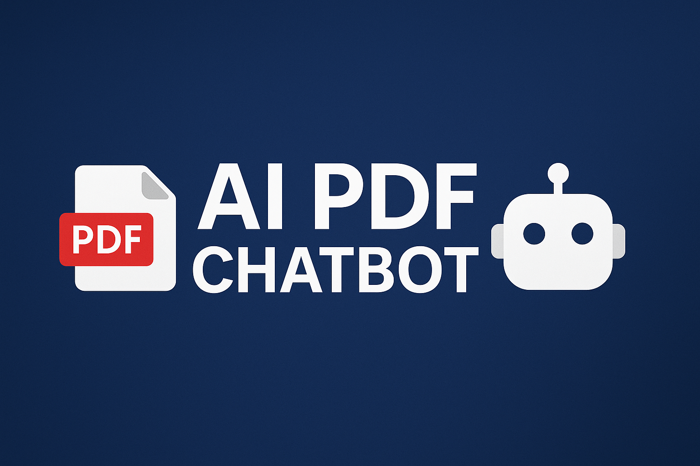

# 📄 AI PDF Chatbot

AI-powered PDF assistant that lets you upload a PDF and ask questions based on its content. Built using **React.js** for the frontend, **Flask + Langchain + OpenAI API** for the backend.

## 🚀 Live Demo

- **Frontend**: [AI PDF Chatbot UI on Vercel](https://ai-pdf-chatbot-clean-felz3rh1v-avdhuts-projects.vercel.app/)
- **Backend**: [AI PDF API on Render](https://ai-pdf-chatbot-clean-api.onrender.com/)

## ⚙️ Features

- Upload and analyze PDF documents
- Ask questions directly about the uploaded PDF
- AI-generated answers using OpenAI's GPT
- Clean and responsive UI with TailwindCSS

## 🛠 Tech Stack

- **Frontend**: React.js, TailwindCSS, Vercel
- **Backend**: Flask, Langchain, PyMuPDF, Chroma DB, OpenAI, Render

## 📂 Project Structure

super-clean-bot/
├── backend/
│ ├── app.py
│ ├── uploads/
│ ├── requirements.txt
├── frontend/
│ ├── public/
│ ├── src/
│ ├── App.js
│ ├── ...
├── Procfile

## ⚙️ Setup Instructions

### Backend
cd backend
pip install -r requirements.txt
python app.py

### Frontend
cd frontend
npm install
npm run start

✅ Deployment
Frontend is deployed on Vercel

Backend is deployed on Render

📧 Contact
Made with passion by Avdhut Shinde
GitHub: @Avdhut30

